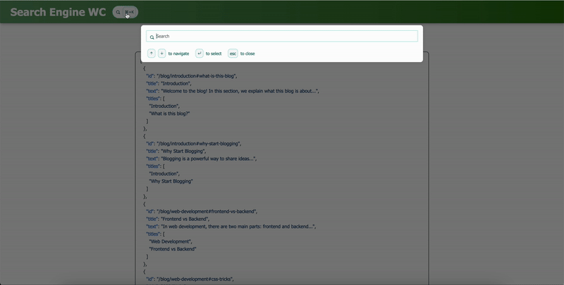

# `<search-engine-wc />`

<div align="center">

<a href="https://brisa.build" target="_blank" rel="noopener noreferrer">
  
</a>

[](https://badge.fury.io/js/search-engine-wc)

[](https://bundlephobia.com/package/brisa)

</div>

This Web Component allows you to have a **search engine** similar to **Vitepress** easily in any framework _(React, Brisa, Vue, Solid.js, Svelte, Vanilla JS, etc)_.

Includes:

- [**MiniSearch**](https://lucaong.github.io/minisearch/)
- [**Mark.js**](https://markjs.io/)
- [**Signals**](https://github.com/tc39/proposal-signals)
- [**Declarative Shadow DOM**](https://web.dev/articles/declarative-shadow-dom) (You can do SSR of it without problems)

## [🔗 Demo](https://search-engine-wc.vercel.app/)



## Getting Started

### In any framework except Brisa

Add these scripts into your `<head>`:

```html
<script type="importmap">
  {
    "imports": {
      "brisa/client": "https://unpkg.com/brisa@latest/client-simplified/index.js"
    }
  }
</script>
<script type="module" src="https://unpkg.com/search-engine-wc@latest"></script>
```

Alternatively, you can install it via npm:

```bash
npm install search-engine-wc
```

And then import it in your code:

```js
import "search-engine-wc";
```

> [!NOTE]
>
> You need to add the `importmap` for `brisa/client`. All the web components made with Brisa need this wrapper to run, the good thing is that if you have other WC made with Brisa you won't need again to add the 3kb that `brisa/client` occupies.

#### SSR

**Pre-requisites**: You need to have [Brisa](https://brisa.build) installed.

For SSR you can use the `renderToString` function from `brisa/server`:

```tsx
import { renderToString } from "brisa/server";
import { jsx } from "brisa/jsx-runtime";
import SearchEngineWC from "search-engine-wc/server";

const jsonUrl = "/demo.json";
const htmlString = await renderToString(jsx(SearchEngineWC, { jsonUrl }));
```

### In Brisa Framework

First install:

```bash
bun add search-engine-wc --save --exact
```

Then import it in your `src/web-components/_integrations.ts` file:

```ts
import type { WebComponentIntegrations } from "brisa";

export default {
  "search-engine-wc": {
    client: "search-engine-wc",
    server: "search-engine-wc/server",
    types: "search-engine-wc/types",
  },
} satisfies WebComponentIntegrations;
```

### Usage

```html
<search-engine-wc jsonUrl="/demo.json" />
```

To work properly you have to provide a JSON with all the sections of your pages.

```json
[
  {
    "id": "/blog/introduction#what-is-this-blog",
    "title": "Introduction",
    "text": "Welcome to the blog! In this section, we explain what this blog is about...",
    "titles": ["Introduction", "What is this blog?"]
  },
  {
    "id": "/blog/introduction#why-start-blogging",
    "title": "Why Start Blogging",
    "text": "Blogging is a powerful way to share ideas...",
    "titles": ["Introduction", "Why Start Blogging"]
  },
  {
    "id": "/blog/web-development#frontend-vs-backend",
    "title": "Frontend vs Backend",
    "text": "In web development, there are two main parts: frontend and backend...",
    "titles": ["Web Development", "Frontend vs Backend"]
  },
  {
    "id": "/blog/web-development#css-tricks",
    "title": "CSS Tricks",
    "text": "Here are some advanced CSS tricks that will help you in your projects...",
    "titles": ["Web Development", "CSS Tricks"]
  },
  {
    "id": "/blog/javascript-basics#variables-and-scope",
    "title": "Variables and Scope",
    "text": "Understanding variables and scope is fundamental to JavaScript...",
    "titles": ["JavaScript Basics", "Variables and Scope"]
  },
  {
    "id": "/blog/javascript-basics#arrow-functions",
    "title": "Arrow Functions",
    "text": "Arrow functions are a shorter way to write functions in JavaScript...",
    "titles": ["JavaScript Basics", "Arrow Functions"]
  },
  {
    "id": "/blog/css-grid#layout-with-css-grid",
    "title": "Layout with CSS Grid",
    "text": "CSS Grid is a powerful tool for creating two-dimensional layouts...",
    "titles": ["CSS Grid", "Layout with CSS Grid"]
  },
  {
    "id": "/blog/css-grid#responsive-design",
    "title": "Responsive Design",
    "text": "Designing responsive layouts is key in modern web development...",
    "titles": ["CSS Grid", "Responsive Design"]
  },
  {
    "id": "/blog/seo#on-page-seo",
    "title": "On-Page SEO",
    "text": "Optimizing your website's content is crucial for on-page SEO...",
    "titles": ["SEO", "On-Page SEO"]
  },
  {
    "id": "/blog/seo#technical-seo",
    "title": "Technical SEO",
    "text": "Technical SEO involves optimizing the infrastructure of your site...",
    "titles": ["SEO", "Technical SEO"]
  },
  {
    "id": "/blog/advanced-javascript#promises-and-async-await",
    "title": "Promises and Async/Await",
    "text": "Promises and async/await simplify asynchronous programming in JavaScript...",
    "titles": ["Advanced JavaScript", "Promises and Async/Await"]
  },
  {
    "id": "/blog/advanced-javascript#closures",
    "title": "Closures",
    "text": "Closures are a key concept in JavaScript that allow functions to access variables...",
    "titles": ["Advanced JavaScript", "Closures"]
  }
]
```

## Props

- `jsonUrl`: The URL of the JSON file with all the sections of your pages.
- `maxResults`: The maximum number of results to show. (Default: `15`)

## CSS Variables

```css
--search-engine-color: #07645a
  /* The color of the text (borders are derived colors from this) */;
```

> [!NOTE]
>
> Dark mode is supported by default with the `color-scheme` css property (`light` / `dark`).

## Types

```ts
export default function SearchEngineWC(props: {
  jsonUrl: string;
  maxResults?: number;
}): JSX.Element;
```

## Notes for Contributors

Good to know:

1. The code is inside `src/web-components/search-engine-wc.tsx`, the other files from `src` is for the demo.
2. `bun run build` do the build of both (demo + web component).
3. `bun dev` you can preview the WC inside the demo on https://localhost:3000.

## License

MIT
